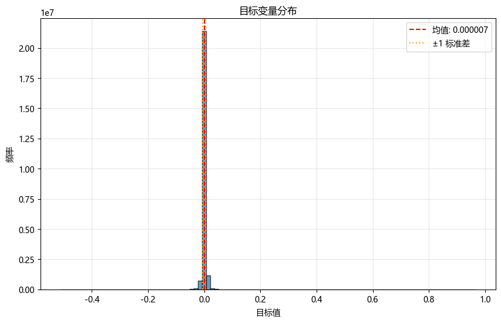
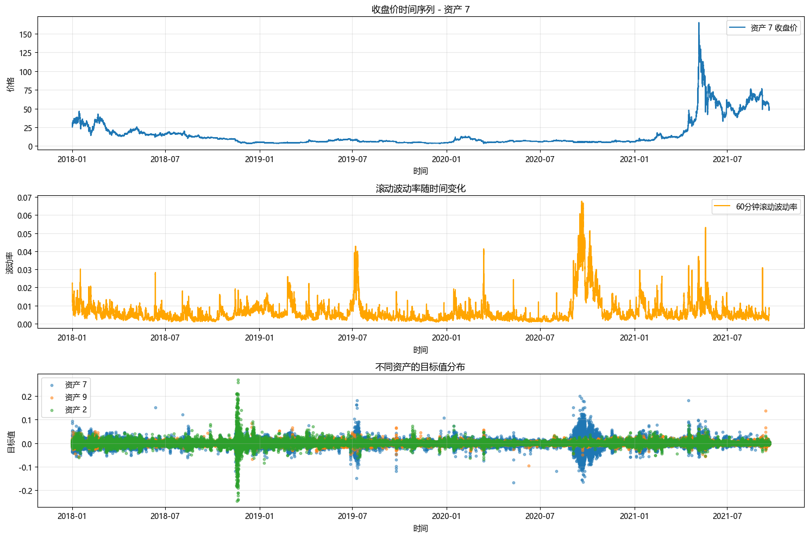
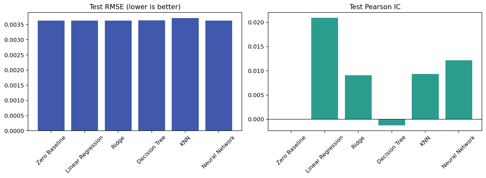
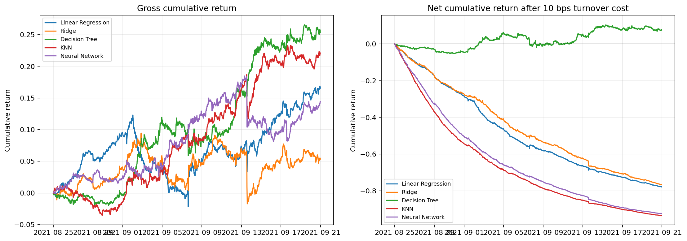

# G-Research Crypto

> A leakage-aware machine-learning benchmark for short-horizon crypto return residuals using the Kaggle G-Research Crypto Forecasting dataset.

本项目基于 Kaggle G-Research Crypto Forecasting 的分钟级聚合数据，对多种加密资产的短期收益残差 `Target` 进行预测，并将模型输出转化为可执行的横截面多空信号。项目覆盖数据处理、特征工程、时间外评估、策略构建、交易成本与风险分析的完整研究链路。

## 项目概览

正式 180 天实验已经完成。源窗口包含 3,627,788 条分钟记录；在连续序列上生成特征后，每隔 10 个时间点抽样，共使用 362,573 条记录建模，并在 54,409 条时间外测试记录上统一评估。


## 数据探索

下图来自原始全量数据的历史 EDA，用于展示目标变量的尖峰厚尾特征，以及价格、波动率和不同资产 Target 随时间变化的市场状态差异。





## 方法

- 数据窗口：2021-03-25 至 2021-09-21，覆盖 14 种资产。
- 特征：19 个仅使用当前及历史信息的收益、波动率、动量和量价特征。
- 抽样：先在连续分钟序列上计算滚动特征，再每隔 10 个时间点抽样。
- 切分：按时间顺序划分训练、验证和测试集，预处理仅在训练集拟合。
- 模型：零预测基线、线性回归、Ridge、决策树、KNN、小型神经网络。
- 指标：RMSE、MAE、Pearson IC、方向准确率和预测头尾分位的实际 Target 差值。
- 计算约束：KNN 训练集按时间等距限制为 20,000 条，其余模型使用 308,164 条训练与验证记录。

## 运行

从 [Kaggle competition data page](https://www.kaggle.com/competitions/g-research-crypto-forecasting/data) 下载 `train.csv`。原始数据不会包含在仓库中。

```bash
python -m pip install -r requirements.txt
python run_experiment.py --data-path /path/to/train.csv
```

结果写入 `artifacts/`：

- `metrics.csv`：整体模型比较；
- `per_asset_metrics.csv`：分资产指标；
- `model_comparison.png`：RMSE 与 Pearson IC 对比。
- `strategy_metrics.csv`：策略成本、换手、收益与回撤；
- `strategy_timeseries.csv`：各次调仓的毛收益和净收益；
- `strategy_cumulative_return.png`：五类模型的毛／净累计收益曲线。

## 结果

| 模型 | 测试 RMSE | MAE | Pearson IC | 方向准确率 | 头尾十分位 Target 差 |
|---|---:|---:|---:|---:|---:|
| 零预测基线 | 0.00363039 | 0.00209183 | — | — | — |
| 线性回归 | **0.00363006** | 0.00209299 | **0.0209** | 50.28% | 0.000130 |
| Ridge | 0.00363150 | 0.00209280 | 0.0090 | 50.42% | 0.000180 |
| 决策树 | 0.00364210 | 0.00209556 | -0.0013 | 51.48% | 0.000009 |
| KNN | 0.00371624 | 0.00219412 | 0.0093 | 50.11% | 0.000128 |
| 神经网络 | 0.00363717 | 0.00209584 | 0.0122 | 51.08% | **0.000216** |



线性回归取得最高 Pearson IC，但其 RMSE 仅比零预测基线低约 0.009%。复杂模型没有形成稳定优势，说明仅依赖历史 OHLCV 与成交笔数构造的量价特征，对这一高度噪声化目标的增量预测力有限。相比追求更复杂的模型，后续研究更应关注跨资产、订单簿与市场状态特征，并采用滚动窗口验证。

## 多空策略原型

将模型预测转化为以下固定规则：

1. 每 20 分钟对 14 种资产的预测值进行横截面排序；
2. 等权做多预测排名前 20%的资产，等权做空后 20%，总多头和空头敞口各 50%；
3. 每次调仓按组合权重变化计算换手，扣除每单位换手 10 bps 成本；
4. 使用随后 20 分钟的实际收盘价收益计算组合损益，不使用 `Target` 代替真实收益。

| 信号模型 | 平均换手 | 毛累计收益 | 扣费后净累计收益 | 净胜率 | 最大回撤 |
|---|---:|---:|---:|---:|---:|
| 线性回归 | 0.856 | 16.66% | -77.89% | 28.82% | -77.86% |
| Ridge | 0.776 | 5.38% | -76.67% | 30.16% | -76.69% |
| **决策树** | **0.079** | **25.36%** | **7.53%** | **48.58%** | **-7.79%** |
| KNN | 1.506 | 22.10% | -93.47% | 16.32% | -93.46% |
| 神经网络 | 1.399 | 14.45% | -92.46% | 18.37% | -92.46% |



结果表明，预测相关性并不自动转化为可交易收益；换手控制对短周期策略更关键。决策树信号在本测试窗口中依靠较低换手保留了正净收益，而其余模型的毛收益被成本完全侵蚀。

## 风险与下一步

当前策略已经形成明确的信号、持仓、调仓与成本规则，但结果来自单一历史时间外窗口。下一阶段将使用扩张窗口／滚动窗口覆盖不同市场状态，并加入滑点、可成交量约束、资产映射和参数稳定性检验，再判断策略能否进入模拟盘。
